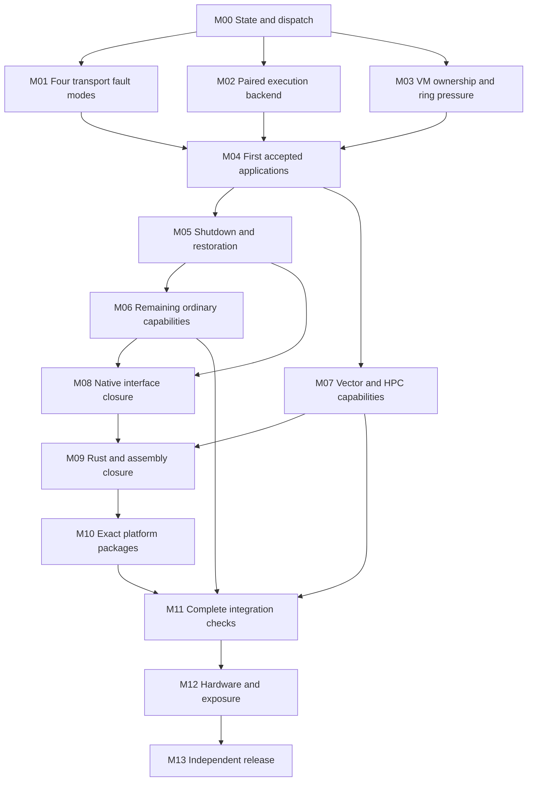

# Remaining OS work and economical agent dispatch

Prepared 2026-09-14 against `9d90b588bae761a6cea6596827f8cc296a3ee642`
and the existing untracked work recorded in `source-index.json`.

The objective is a functional, stable x86_64 McKernel implemented in Rust and
reviewed assembly, controlled by the pinned Rocky/Linux 6.12 kernel and native
Rust IHK, SMP and mcctrl modules. Completion includes the application catalog,
native lifecycle, packaging, qualification and independent release acceptance.
Advance by evidence-backed milestones. There is no calendar deadline.

Use one capable dispatcher, two inexpensive workers when independent work is
ready, and a third worker slot for a focused reviewer. Builds and guests have
one owner and run serially. Spend model tokens on decisions, defects and review;
let scripts perform inventories, hashing, compilation, comparisons and counting.

## What to read and run

1. Use `GOAL.md` for a durable autonomous goal; `START.md` is the dispatcher prompt.
2. Read this document once as the dispatcher. Workers receive a selected task.
3. Run `python3 -B docs/verification/os-milestones-20260914/dispatch.py check`.
4. Select a task with `dispatch.py task M01-A`, a gate with
   `dispatch.py gate MCC-006`, or a case with `dispatch.py case startup.argv-empty`.
5. Use `tasks.json`, `gate-map.json`, `case-map.json` and `source-index.json` as
   indexes. Read their selected objects through the helper; they are not a
   request to place every object into every agent's context.

This package is a planning and routing record. It grants no application runtime
acceptance or guest release. Existing `AGENTS.md`,
`docs/verification/stability-goal-20260913.txt`, the latest continuation in
`stability-run-20260913.md`, original contracts and independently reviewed
execution packets control implementation and validation. Historical scheduling
and completed model-switch instructions are superseded by the active goal.

## Verified starting position

The audit indexed 10,531 repository paths reported by `rg --files`, read the
authoritative tracker/roadmap sections, and inspected current blocker contracts
and implementation interfaces. This is a repository planning audit, not a
line-by-line correctness review of every source or archived capture. The exact
gate and case indexes preserve coverage without requiring repeated broad reads.

| Existing progress record | Recorded result | What remains |
| --- | --- | --- |
| `overview.txt`, `overview2.txt` | 96.7% broad functional dashboard; core rows 100% | Historical scoped ownership; build/tool/platform and production evidence remain separately tracked. |
| `migration.txt` | Strict core sequencing 100%; standalone sequencing 500/500 | Remaining implementation primitives and executable dependencies need closure. |
| `full-port.txt` | Historical campaign 100%, 611.9/611.9 | Preserve the closed score. |
| `rust-source-retirement.txt` | Historical classification 100%, including 62 allowlisted C boundaries | Exact production image still needs Rust/assembly closure. The conservative historical image was 78.354960% Rust executable bytes; the later ABI repair was 78.356795%. The remainder includes assembly, C, other origins and padding. |
| `VALIDATION_PROGRESS.MD` | 10/10 historical Rocky smoke gates | Preserve its exact artifact scope; it does not qualify the new production set. |
| `final-push.txt` | 350/10,000 points, 3.50%; 130 gates: 6 PASS, 1 IN_PROGRESS, 123 TODO | All original gate contracts remain in `gate-map.json`; the score measures accepted evidence. |
| MK-LANG-001 through 007 | Three IN_PROGRESS; four TODO | Rust preservation, executable/dispatch closure, native runtime and reproduction. |
| Application draft queue | 97 packets, 273 cases; 6 DRAFTED, 267 DRAFTED_WITH_UNRESOLVED | Three reviewed fixtures compiled; zero catalog cases executed or accepted. |
| Current native application baseline | Repaired module2026091301/image3; eight original suites passed | Keep current compiler/input bindings and rerun affected regressions after code changes. |
| Transport faults | Hard-before-publication and permanent-backpressure accepted in their narrow contracts | Published notification failure and recoverable backpressure remain; physical saturation is a separate requirement. |
| Latest prepared published guest | Native build and retained preparation/comparator evidence reviewed | SELECT-to-release cancellation/no-wake ownership blocks PRE_INPUT and guest release. |
| Linux reference collector | Build, nine SHA cases and one non-root rejection independently reviewed | Root 25-case profile, adverse cases, native collector and paired execution remain. |

The deterministic tracker, 273-case/97-packet validator and retained draft-audit
comparison passed during this planning run. The audit confirms nine references
already corrected additively, seven input length/hash findings, 22 inspected
simulated failure/exhaustion fixtures and 220 classified reviewer questions.
Reuse those corrections and classifications; solve the unresolved behavior in
new versions. `run.py` implements metadata preflight and always reports NOT_RUN
with `backend_implemented=false`.

The newest independent review files and selected-retention/collector helpers
were still untracked at the planning baseline. M00-A preserves and incorporates
them explicitly. Do not discard them or assume another checkout contains them.

## Agent arrangement and setup

The local CLI is `codex-cli 0.153.4`. Its configured primary is `gpt-6-astra`
with `max` reasoning. The local advertised model list includes Astra, Sol,
Terra and Luna. Advertisement establishes available model names; a successful
call and available account quota still need to be checked when execution starts.

| Role | Recommended starting configuration | Scope and escalation |
| --- | --- | --- |
| Dispatcher | Astra, medium for the first autonomous run; Terra/medium is an economical alternative | Prioritize ready tasks, hold file/build leases, maintain state and checkpoint; send hard design/review to a bounded expert task. |
| `os_auditor` | Luna, low | One inventory, source-reference audit or retained-result comparison; read-only. |
| `os_worker` | Luna, medium | One specified fixture, parser change or focused test. Escalate ambiguity to the dispatcher. |
| Bounded repair escalation | Terra, medium or high, explicitly requested | One reproduced defect with known files and a frozen oracle. |
| `os_reviewer` | Astra, high | Independent review of ownership, concurrency, unsafe code, ABI, execution release or final evidence. |
| Runtime operator | Dispatcher invokes deterministic tools | Own one build/guest lease; write raw evidence and machine summaries. No extra model just to watch logs. |

These are starting choices, to be adjusted from measured accepted work per
token. Cheap workers should receive simple tasks; reducing model cost does not
make an ambiguous kernel task simpler. Reserve the capable reviewer for changes
whose failure could invalidate memory ownership, runtime evidence or acceptance.

You can lower this existing chat from Astra/max to Astra/medium, then resume
`CURRENT.md`. This is the recommended first autonomous setup while ownership and
backend design are still open. Terra/medium is an alternative coordinator; Luna
is best reserved for fully specified tasks initially. Max is a reasoning level,
while Astra/Terra/Luna select models. Lower effort can reduce reasoning tokens;
it does not guarantee lower total cost after retries and review. Switching the
parent does not require restarting the repository work.

Project configuration is supplied in `.codex/config.toml`, with narrow roles in
`.codex/agents/`. It sets three spawned threads and Luna/low as the default for
otherwise unspecified workers. Explicit worker/reviewer roles select their
own effort/model. Start a fresh session in this repository for project settings
to load. Local inspection found that this exact repository is not in the CLI's
trusted-project list, so its project config is currently skipped. The launch
command below supplies worker defaults explicitly and the starter prompt names
models, so it can operate without the custom roles. To enable automatic local
role discovery later, trust this exact repository through the CLI's normal
project setup. A direct spawn instruction should still name model and effort;
unspecified children can inherit the parent's settings. See the official
[subagent guide](https://learn.chatgpt.com/docs/agent-configuration/subagents)
and [configuration reference](https://learn.chatgpt.com/docs/config-file/config-reference).

The current conversation's tool limit is four active agents including the
primary. Model overrides here require a fresh or bounded context fork; use
`fork_turns="none"` with a self-contained packet, rather than a full-history
fork. If this client does not expose custom role selection, explicitly request
the model and use the same role instructions in the task message. The CLI role
files are a reusable setup for future local sessions, not a claim that this
already-running conversation was reconfigured.

Start the dispatcher interactively:

```bash
codex -C /home/holden/mckernel -m gpt-6-astra --enable goals \
  -c 'model_reasoning_effort="medium"' \
  -c 'agents.max_concurrent_threads_per_session=3' \
  -c 'agents.default_subagent_model="gpt-5.6-luna"' \
  -c 'agents.default_subagent_reasoning_effort="low"' \
  'Read docs/verification/os-milestones-20260914/START.md and execute its dispatcher instructions.'
```

Use `/goal` for the durable run; the complete objective and resume steps are in
`GOAL.md`. Official [goal instructions](https://learn.chatgpt.com/use-cases/follow-goals)
document multi-turn work and `/goal pause` / `/goal resume`. The existing goal
was observed as `usageLimited` during planning; resume it after quota is
available, with GOAL.md as its current execution instructions. A 12-hour session
is an unattended work window, not the completion deadline for all qualification.

No agent needs the whole history to begin. A concrete dispatch request is:

> Execute M00-A. Then spawn os_auditor on M02-A and os_worker on M01-B only after
> M01-A has supplied its reviewed contract. Give each only its task packet and
> required sources. Use Luna with explicit effort and a fresh context. Keep the
> third slot available for os_reviewer. Only the dispatcher may launch builds
> or guests. Continue ready work without asking at each packet.

Two prior audit agents reported an account usage limit. Do not retry spawning
in a loop. Preserve the cursor and use remaining deterministic work; resume once
quota is available. A different model does not guarantee a different quota.
No paid agent execution was used to validate this configuration package.

## Milestone dependency map



Arrows describe completion dependencies. Independent preparation can begin
earlier: platform acquisition/package design from M00, source inventories from
M00, lifecycle design from M01, and a Rust replacement as soon as its behavior
has runtime coverage. Complete the earliest blocker to useful execution first.
Family coverage grows again in M06/M07; M04 does not wait for every advanced
capability. Per-case `requires` and `depends_on` always take precedence over a
family's position in this diagram.

## M00 — Durable state, preserved work and economical dispatch

Entry: the current checkout and retained evidence are available.

| Task | Specific work and completion check | Owner |
| --- | --- | --- |
| M00-A | Record HEAD, tracked diff, untracked file identities and active dependencies. Inspect and preserve the newer independent reviews, selected-retention candidate and collector orchestration. Create a checkpoint without incorporating unrelated files. Confirm the remote commit and fetched file identities. | Dispatcher + auditor |
| M00-B | Create a current live cursor with all 130 production gates, seven language gates, 273 cases and 97 original packet mappings. Import the nine existing corrections; carry seven input findings, 22 simulated fixtures and 220 question classifications to their selected tasks. Add newer fault evidence with exact scope. Reconcile every ID exactly once. | Auditor; dispatcher owns state |
| M00-C | Reduce repeated instruction loading. Archive the original 316,908-byte `AGENTS.md` byte-for-byte with its hash; independently check a proposed concise active instruction file against all still-operative requirements before replacing it. Keep historical evidence and current authorization/resource/reuse/failure rules reachable. Target a 1–2K-token active instruction body. Do not hide required instructions by lowering the document limit. | Dispatcher + reviewer |
| M00-D | Assign disjoint file ownership and one build/guest lease. Check actual host and scratch capacity before heavy work; this audit found about 41 GiB host free and 23 GiB scratch free. Preserve measured build/capture floors and emergency space. Remove only verified redundant copies under the existing cleanup procedure. | Dispatcher |
| M00-E | Pilot cheap dispatch on one small evidence task and one specified fixture task. Record selected model, input/cached/output/reasoning usage if reported, reviewer corrections and accepted deliverable. Keep Luna where it saves total cost including review; escalate only the failed task. | Dispatcher |

Exit: coverage and checkpoint verified; active ownership/cursor recoverable;
workers have explicit model settings and narrow packets. The static indexes in
this package seed M00-B; they do not replace a live accepted-evidence ledger.

## M01 — Close published-response ownership and all four fault modes

Entry: use `stability-run-20260913.md`'s last continuation and the selected
retention README. Preserve both accepted original fault outcomes and the first
published module/root, including all failures.

| Task | Specific work and completion check | Owner |
| --- | --- | --- |
| M01-A | Trace SELECT through cancellation, prepare errors, no-wake completion, publication, drop and OS backing lifetime. Review the existing selected-retention candidate; enumerate every actual mutation/removal path. Require the original selected Response/Completion to remain owned until its exact committed release. | Dispatcher + reviewer |
| M01-B | Complete focused tests against actual retained methods: stage 0/1/2/4/5/invalid and stage3-with-commit0; wake Some/None; worker-close/cancel-pending before and after prepare; bad servicing TID/status/wake and second-CAS failure; changed claim fields; unselected control paths. Rejection preserves owners and never calls release. | Worker implements explicit matrix |
| M01-C | Check stager hash drift, missing/duplicate hooks, wrong mode, reused output, symlinks/FIFOs and inverse restoration. Compile a fresh candidate in the pinned container; bind all compiler inputs and inspect affected stack frames/calls. Preserve the original five-file hold composition and three-file retention delta. | Worker prepares; dispatcher runs; reviewer accepts |
| M01-D | Integrate selected-span physical-read guards, PRE_INPUT retention proof, release latch, exact UART digest and capture receipt membership. Exercise the retained 16-case guard harness and relevant parser/controller checks at their pinned source versions. Validate the live polling state machine; the 21 classifier cases alone are insufficient. | Worker + reviewer |
| M01-E | Release a reviewed mode2 guest; prove one actual publication, actual wake-ring behavior, correct accepted-return identity and no host access after transfer. Release mode3 separately; preserve result through retries and pass eight actual subsequent HELLO applications plus AFTER8 in the same OS. | Dispatcher runs; independent reviewer joins raw evidence |

Exit: four fault-mode contracts independently accepted and bound to their exact
test/production inputs. Verification-only builds are identified explicitly.
Injected EAGAIN earns no physical-ring-full credit. Stack prefix sums are not a
complete kernel stack certificate. Any ownership failure keeps the affected
guest/capability blocked and returns a minimal reproducer to the dispatcher.

Starting paths: `scripts/tests/prepare_stability_selected_retention.py`,
`scripts/tests/fixtures/stability-selected-retention-v1/`,
`scripts/tests/prepare_stability_published_guest.py`,
`scripts/tests/run_stability_published_guest.py`,
`scripts/application-tests/published_*`, and the exact staged copies of
`smp_application.rs`, `smp_application_syscall.rs`, `application_syscall.rs`.

## M02 — Trustworthy Linux/McKernel execution and comparison

Entry: infrastructure work can proceed alongside M01. Catalog execution awaits
M01/M03 and all original global and case gates.

| Task | Specific work and completion check | Owner |
| --- | --- | --- |
| M02-A | Review the existing root collector profile/orchestrator and host-Python adaptation. Join child identity, descriptor sealing, setup failure, watchdog, root/container ownership and complete cleanup. Produce an exact 25-case run packet from `root-profile.md` and `tests.md`. | Auditor + reviewer |
| M02-B | Execute the root 25-case profile under the isolated runtime owner, plus remaining adverse storage/late-signal/stop/setup cases. Retain raw status, streams, actual identity and cleanup for every case. Reuse valid build/SHA9/non-root evidence when source bindings still match. | Dispatcher runs |
| M02-C | Define and implement the native payload collector: distinguish launcher from real McKernel process/TID, bind request generation/delivery, observe payload termination and actual interpreter/DSO mappings, capture side effects and typed owners. Freeze the native ABI before cheaper implementation. | Dispatcher designs; worker implements bounded parts; reviewer |
| M02-D | Convert reviewed packet001-v3 metadata into new strict runtime records. Preserve expected bytes. Explicitly map environment to env and numeric umask 18 to string 0022; resolve independent-oracle schema incompatibilities. Establish immutable pathname execution where a case requires pathname identity; sealed descriptors alone do not prove it. | Worker + reviewer |
| M02-E | Compose preflight, preparation, paired collectors and evaluator. Run identical payload bytes and frozen inputs directly on pinned Linux and through unchanged mcexec; reset inputs between engines. Join both collections by exact case/parameter/input identity. | Worker; dispatcher integrates |
| M02-F | Verify stale/changed hashes, missing capabilities/oracles, malformed output, wrong signal classification, raw wait status, full dual streams, existing attempts, timeout, failed QMP resume, missing provenance and incomplete loader closure all reject. Prove positive success with reviewed infrastructure fixtures before catalog release. | Worker + independent reviewer |

Exit: runner/collector contracts accepted in their explicit scopes; real paired
execution, cleanup and evaluation are possible; a fully eligible reviewed case
can earn acceptance only from its actual evidence. The current preflight's
unconditional BLOCKED behavior stays until this reviewed integration is ready.

Starting paths: `scripts/application-tests/run.py`, `runtime_contracts.py`,
`supervisor.py`, `owner_observations.py`, `qmp_capture.py`,
`docs/verification/stability-application-backend-map-20260913.md`, and
`scripts/tests/fixtures/application-collector-v1/linux-sealed-v1/`.

## M03 — VM invalidation ownership, physical pressure and safe admission

Entry: source work starts immediately; runtime uses accepted transport and
observation infrastructure. This milestone repairs the concrete failed-clear
gap recorded in `stability-invalidation-ownership-review-20260913.md`.

| Task | Specific work and completion check | Owner |
| --- | --- | --- |
| M03-A | Implement the proposed private pinned `PendingFreeBatch` transfer primitive. Preserve list order/page metadata, repair boundary links, reset the source NULL/NULL, reject invalid state without mutation, and never allocate/free during detach. No implicit freeing destructor or Send/Sync shortcut. | Dispatcher defines; bounded worker; reviewer |
| M03-B | Use exact retained begin/enqueue/finish helpers for empty, one/many page, source reuse, destination drain, duplicate/invalid detach and two-head independence tests. Explicitly cover partial-validation failure before any release. | Worker |
| M03-C | Define an actual transaction owner across preemption/migration and failed host invalidation. Cover detached ranges, memobj/backing classes, VA exclusion and Linux aliases. Complete validation precedes release. A retained response tag is insufficient evidence of retained guest pages or invalidated Linux PTEs. | Dispatcher + reviewer |
| M03-D | Integrate munmap/mprotect/XPMEM and host Mirror::clear outcomes. Exercise wrong-MM/preflight rejection, partial guest edit, clear failure, blocked publication, SIGKILL during MM work and inherited Linux aliases. Independently inventory real pages/MM/PTE identities and forbid reuse while stale mappings can survive. | Worker prepares narrow cases; dispatcher runs |
| M03-E | Create real full-ring pressure in both directions, observe wrap/capacity/barriers and delayed consumption, then verify recovery with exact counts. Check admission closes on terminal service failure and retained owners remain stable at terminal and at least five seconds later. | Dispatcher + reviewer |

Exit: failed invalidation retains every required owner; successful release has
actual alias/TLB/MM proof; physical saturation/recovery and admission behavior
are independently accepted. A permanently quarantined OS has a retained-state
contract; recovery tests apply only where safe recovery was established.

Starting paths: `kernel/rust/mem_helpers.rs`, `process_helpers.rs`,
`kernel/mem.c`, `kernel/syscall.c`, `kernel/rust/tests/run_memory_equivalence.py`,
`host-kernel/native-rust/application_pager.rs`, `smp_application_syscall.rs`,
`ikc_queue.rs`, and the pending-free design/review documents.

## M04 — First accepted catalog packets and useful application coverage

Entry: M01–M03 and current-input, runner, transport and each selected case's
capabilities pass; release a new independently reviewed execution packet.

| Task | Specific work and completion check | Owner |
| --- | --- | --- |
| M04-A | Release startup.argv-empty, startup.environment and startup.stdout-stderr using the reviewed sources and frozen oracles. Rebuild only if input bindings require it. Obtain actual Linux and McKernel evidence plus independent acceptance. | Worker prepares; dispatcher runs; reviewer |
| M04-B | Follow existing queue order among eligible packets: calloc/realloc, closed-fd errors, ordinary futex errors, alternate signals, then unchanged cat and subsequent supported cases. Mark blocked dependencies explicitly and continue unrelated ready work. | Worker, at most three active cases |
| M04-C | Resolve each of seven input length/hash findings in a new immutable input/oracle version. Expand declared parameters exactly. Freeze independent expected bytes/relations before execution; do not copy production outputs into expectations. | Auditor/worker |
| M04-D | After a short case first passes, complete three additional same-OS repetitions and one fresh-guest repetition. Fault attempts use fresh guests. Freeze batch membership before launch. | Deterministic runner |
| M04-E | Once all seven members pass, run the existing ten-cycle campaign: cat-file, wc-bytes, sha256sum, cp, numeric sort, gzip compression and decompression. Keep the 300-second guest cap and original input resets. | Dispatcher |

Exit: the first three catalog cases are accepted with required repeats, the
eligible basic queue is advancing, and the seven-member repeatability campaign
passes once its prerequisites are met. Record exact accepted/failed/blocked
logical cases separately from reference runs, parameters and repetitions.
Advanced cases continue under M06; vector cases continue under M07.

| Catalog family | Logical cases | Main verification work |
| --- | ---: | --- |
| startup | 10 | argv/env/cwd/umask/auxv/page size/stdin/stdout and raw exit behavior. |
| memory | 24 | alloc/realloc, mmap/protect/unmap, access boundaries, cleanup and failure ownership. |
| file | 30 | descriptor/error cases, offsets, streams, regular-file contents, mapping and permissions. |
| thread | 17 | real TIDs, TLS, joins, mutex/barrier/condition/rwlock, cancellation and resource release. |
| futex | 17 | mismatch/address/timeout/wake/requeue/robust/owner-death with observed scheduling. |
| signal | 18 | masks/pending/actions/altstack/nesting/restart/external recipient and termination. |
| time | 10 | actual clock contract, sleeps/timeouts, monotonicity, deadline semantics and interruption. |
| process | 20 | fork/COW, child ownership, exec/wait, reparenting, process groups and limits. |
| ipc | 16 | pipes and declared IPC behavior with exact errors, contents and cleanup. |
| loader | 8 | static/PIE/interpreter/extended execution contracts and real binary/library provenance. |
| app | 20 | unchanged pinned utilities, deterministic files/streams/exit and ten-cycle campaign. |
| numerical | 5 | independent integer/FP results and declared tolerances; deterministic workload inputs. |
| failure | 12 | real phase injection and independently observed unwind/retention. |
| exhaust | 10 | actually reach each configured resource limit; observe bound, errno, owners and recovery. |
| vector | 56 | capability discovery, opcode audit, arithmetic, transitions, signals and xstate. |

The total is 273. `case-map.json` contains every exact ID, source/oracle pointer,
original packet, dependency, capability and parameter identity. The table does
not imply every family member is ready together.

## M05 — Real shutdown, drain and resource restoration

Entry: reproducible startup/application execution and explicit transport/VM
ownership. Begin lifecycle design while earlier runtime gates are in progress.

| Task | Specific work and completion check | Owner |
| --- | --- | --- |
| M05-A | Specify lifecycle states and lock/ownership order: reject new admission, drain applications/senders, stop McKernel CPUs, drain IRQ/work callbacks, retire channels/mappings, restore resources, destroy OS and unload modules. Define every timeout/failure state's retained owner. | Dispatcher + reviewer |
| M05-B | Implement one state transition at a time using existing Rust resource/registry/boot owners. Validate successful, busy, duplicate, partial-init, interrupted and failed-stop paths without fabricating restoration. | Bounded worker; hard lifetime changes on dispatcher |
| M05-C | Snapshot Linux CPU online masks, memory ownership, IRQ affinities, IDs, mappings, files/tasks, devices, procfs/sysfs, binfmt, module refs and policies. Prove return to baseline after actual native stop/release. Disposing of a VM does not prove this. | Auditor defines observer; dispatcher runs |
| M05-D | Recreate and boot an OS after teardown; reload modules in valid order; reject invalid ordering and busy references. Add crash/reset/restart cases with fresh attempts and a complete failure matrix. | Worker + reviewer |

Exit: native boot → workload → stop → destroy → release → unload/reload works
repeatedly with exact restoration, and every failed transition retains or
releases resources according to its reviewed contract. Supports SMP-012,
INT-009/010 and later lifecycle exposure; it does not award them early credit.

## M06 — Advanced process, syscall and failure capabilities

Entry: baseline applications and lifecycle contracts. New capabilities need a
source-bound contract, independent tests and actual guest evidence before cases
requiring them are released.

| Task | Specific work and completion check | Owner |
| --- | --- | --- |
| M06-A | Complete fork/COW/adoption → exec/wait and process/thread/VM registry lifetime, exit/reparenting and credential/group behavior. Observe real child identities and memory effects. | Dispatcher contracts; worker fixtures |
| M06-B | Complete external signal delivery and restart, robust futex owner death, contention/requeue/timeouts, ptrace lifecycle and register/memory access. Validate stopped/continued/dead recipients and tracer exit. | Dispatcher + reviewer; workers per family |
| M06-C | Complete IPC, extended loaders/binfmt, delegated network/resource/credential/scheduler operations, non-root identity/device access, CPU affinity/migration and precise clocks. Pin all executable/DSO/tool versions. | Worker per accepted capability |
| M06-D | Replace the 22 simulated failure/exhaustion fixtures with real injected operations and actual bounded exhaustion. Observe allocation/registration/request/pager/mailbox/worker/handle counters and cleanup; a printed PASS or loop counter does not establish exhaustion. | Workers in packets of at most three |
| M06-E | Close procfs/sysfs read/remove/unload races and remote-memory invalidation with real producers. Execute all remaining non-vector catalog cases as their gates pass, retaining parameter completeness and required repeats. | Worker + dispatcher |

Exit: every required non-vector catalog case has accepted evidence; all other
cases have explicit supported/unsupported/blocked disposition under the original
contract. Required blocked positive cases remain completion blockers. Additional
production syscall/network/ptrace contracts outside the 273-case catalog still
need their own test IDs; the catalog does not replace MCC/INT/PQ coverage.

## M07 — Vector state and HPC/optional feature coverage

Entry: ordinary execution; enable each vector instruction only from both
engines' actual capability evidence. Thread/signal work depends on M06 as needed.

| Task | Specific work and completion check | Owner |
| --- | --- | --- |
| M07-A | Correct CPUID leaf0/1/7/0xD and guarded XGETBV discovery in both engines; validate supported xstate sizes/offsets and fail unsupported feature dispatch safely. Audit all kernel/module executable sections and payload opcodes. | Worker; reviewer for assembly/feature gates |
| M07-B | Verify XMM/YMM/x87/MXCSR across raw syscalls, then arithmetic, guarded-memory and exact crypto known answers against independent scalar/math oracles. Disable accidental reference autovectorization/contraction. | Worker per one-to-three cases |
| M07-C | Add load-transition-store assembly observers for actual thread switches and signal entry/restore; separately prove first-entry initialization before loader/libc clobber and poison-owner retirement. | Dispatcher + reviewer |
| M07-D | Verify extended signal-frame ABI and conditional AVX-512/opmask/high-ZMM cases only with complete both-engine CPUID/XCR0 and storage evidence. Historical host flags or TCG 0x21f are insufficient. Resolve all 56 vector case dispositions. | Worker + reviewer |
| M07-E | Exercise MPI/OpenMP launch, synchronization, message correctness, affinity and oversubscription; validate XPMEM and selected QLMPI/UTI configurations with explicit enabled builds. Preserve disabled/optional consumers and their scope. Add numerical/HPC workload records for later PQ gates. | Workers prepare; dispatcher runs |

Exit: required vector and HPC capabilities accepted on their declared profiles;
conditional unsupported combinations are recorded explicitly and earn no
successful-use credit. Broader topology/performance exposure continues in M12.

## M08 — Complete native Rust module and interface contracts

Entry: earlier runtime/lifecycle contracts; source audits can start at M00.
Treat existing implementations as reuse candidates, not missing work by default.

| Task | Specific work and completion check | Owner |
| --- | --- | --- |
| M08-A | Finish FP-0006's behavior → Rust symbol/build consumer → independent acceptance test map. Include every exported symbol, ioctl/compat/status/packet layout, parameter and procfs/sysfs behavior/error. | Auditor; dispatcher resolves gaps |
| M08-B | Close RS-001–012: pinned bindings/layout, allocation/mapping/NUMA, uaccess/device operations, locks/refcounts/RCU, async cancellation/drain, CPU/IRQ and process service adapters. Refresh every unsafe/FFI site's SAFETY contract and actual compiler context. | Workers per interface; reviewer for unsafe/lifetime |
| M08-C | Close IHK-001–013: registry/device/resource/mapping/ring/master/event operations, concurrency/unload/failure behavior, final zero-project-C module graph and differential parity. | Workers per existing contract |
| M08-D | Close SMP-001–015: topology/resource/boot/image/trampoline/APIC/IRQ, lifecycle, multiple OS isolation and reviewed assembly. Test sparse masks, SMT, NUMA, holes, rollback and hotplug on eligible environments. | Dispatcher + worker fixtures |
| M08-E | Close MCC-001–019: persistent channels, process/VM/request ownership, syscall families, signals/futex/ptrace, procfs/sysfs/binfmt, affinity, remote memory, all unwind paths and exact parity. | Workers per contract; independent reviewer |

Exit: every module/substrate requirement has a complete implementation and
reviewed test mapping. Gates that also require exact packages, Intel/AMD or
performance remain pending their downstream evidence. `gate-map.json` preserves
the full gate wording, points and current status; milestone completion never
automatically rewrites the production tracker.

## M09 — McKernel Rust/assembly executable closure

Entry: runtime coverage for the particular behavior being migrated. Preserve
reference builds until their replacements are verified.

| Task | Specific work and completion check | Owner |
| --- | --- | --- |
| M09-A | Refresh every Rust source consumer and the exact image/map/object/source/compiler/config inventory. Identify remaining C and unknown executable origins, including hidden libraries and external project services. Account separately for assembly, padding and non-executable data. | Auditor |
| M09-B | Replace one covered primitive at a time: allocator/page-table/usercopy; process/VM/lifetime; scheduler/context/timers/futex; signal/exception/syscall dispatch; IKC/driver/boot/support runtime. First reuse retained Rust and Linux APIs where execution context matches. | Dispatcher designs hard parts; worker handles bounded slices |
| M09-C | For each replacement, prove active symbol/build selection, exact ABI/equivalence, necessary C-reference and Rust builds, affected guest regressions, and source-to-binary binding. Keep replacement and retired-path records. | Worker prepares; dispatcher runs; reviewer |
| M09-D | Build final production images/modules with project C implementation unavailable; inspect executable origin and the complete dependency/dispatch graph. Reject C callbacks, wrappers, archives, fallback objects and unknown origins supplying kernel behavior. | Auditor + reviewer |
| M09-E | Re-run native workloads, rollback/shutdown and reproduction against the final Rust/assembly image. Close all seven MK-LANG gates, including optional/test consumer accounting and package provenance. | Dispatcher + independent reviewer |

Exit: MK-LANG-001–007 pass on the final artifact set. Compiling C to assembly,
renaming objects or increasing a source percentage does not satisfy the language
contract. Linux remains the separate control kernel; application code can use C.

## M10 — Reproducible Rocky platform and exact packages

Entry: source/toolchain/package preparation begins early; final packages consume
the completed native module and McKernel implementation.

| Task | Specific work and completion check | Owner |
| --- | --- | --- |
| M10-A | Reconcile RK source/toolchain/configuration locks with actual compiler/build captures; prove rustavailable and an exercised Rust sample. Review generic Linux abstraction patches and deterministic staging with no prebuilt project object substitution. | Auditor + worker |
| M10-B | Produce the exact kernel/core/modules/modules-extra/devel/headers/tools/debug/debuginfo RPM set and matching module/image packages. Reproduce from pinned acquisition, configuration and build inputs. | Worker prepares recipes; dispatcher builds |
| M10-C | Sign artifacts and test enrolled-key acceptance, tamper/unsigned/wrong-version rejection, Secure Boot/lockdown and package contents. Bind signing/release identities without placing credentials in prompts, logs or repository files. | Dispatcher with designated release operator |
| M10-D | Verify parallel stock/custom install, initramfs/GRUB, stock rescue, update/downgrade policy, atomic rollback and uninstall. Boot exact packages under KVM and on required Intel/AMD hardware. | Dispatcher on designated validation systems |

Exit: RK-001–014 and platform contributions to INT/REL have their required exact
package evidence. Keep the current workstation resource/boot boundary; additional
hardware and host-changing validation need a designated permitted environment.

## M11 — Complete integration, failure, security and debug qualification

Entry: final implementation/package candidate; use the supported profile matrix.

| Task | Specific work and completion check | Owner |
| --- | --- | --- |
| M11-A | Run INT-001–013: exact packaged native modules, modinfo/signature/namespace/dependency closure, ABI goldens, boot/tools/syscall/topology, lifecycle/restoration, diagnostics/faults and performance smoke. | Dispatcher; worker reviews one contract |
| M11-B | Compare R1 reference C modules and R2 Rust modules on the same custom kernel/hardware/inputs. Keep R0 historical smoke and R3 stock-Rocky host regressions separately scoped. Verify exact outputs, errno, signals, side effects and final state. | Worker prepares deterministic A/B matrix |
| M11-C | Exercise every failure site and init/partial-init/boot/connect/process/stop/reset/unload transition. Prove faults actually fired. Run malformed ioctl/compat/mmap/packet/parser/ID/size/range/version tests and privilege/namespace/device/mapping protections. | Workers by failure class |
| M11-D | Run KASAN, KCSAN, UBSAN, lockdep, kmemleak, debug-object/refcount/RCU/hung-task/panic-on-warning configurations; retain and triage every finding. Exercise host LTP/kselftest/stress-ng, filesystem/network/service pressure and crash recovery. | Dispatcher schedules configurations |
| M11-E | Prove zero growth in pages/slabs/VMAs/IDs/refs/IRQs/work/tasks/files/devices/procfs/sysfs/binfmt; measure production observability overhead. Freeze a clean candidate before extensive M12 exposure. | Auditor comparisons; reviewer |

Exit: required deterministic and debug integration contracts pass; all findings
have a reproducer and resolution. Multi-vCPU/NUMA profiles beyond this local
limit remain explicit jobs on adequate resources, with no partial gate credit.

## M12 — Hardware, performance and required exposure

Entry: a frozen clean candidate and independently reviewed campaign definitions.
Run campaigns with deterministic supervisors and periodic machine summaries;
agents inspect anomalies and completed reports instead of narrating each sample.

| Task | Specific work and completion check | Owner |
| --- | --- | --- |
| M12-A | Acquire/designate the exact required Intel/AMD classes and topology matrix, including KVM 1/2/8/32 vCPUs, 1/2/4 vNUMA, SMT modes, APIC/x2APIC, hugepages, IOMMU and Secure Boot profiles. Record firmware/microcode/power/IRQ/environment controls. | User supplies access; dispatcher verifies |
| M12-B | Freeze benchmark schemas, seeds, warmup/sample counts, confidence methods and raw evidence. Measure STREAM, NAS, OSU, MPI/OpenMP, syscall/IKC/lifecycle microbenchmarks and host coexistence. | Worker prepares; deterministic runtime |
| M12-C | Execute full lifecycle, module, CPU/memory/fragmentation/NUMA, IKC, delegated syscall, process, signal/futex/ptrace and VM campaigns with exact per-profile counters. Stop and retain the first unexpected failure in the affected job. | Deterministic runtime |
| M12-D | Execute stateful interface/parser fuzzing and uninterrupted Intel/AMD soaks; track clean exposure per immutable candidate and required hardware class. Triage/reproduce/minimize findings before repairing and rebinding affected evidence. | Workers minimize failures; dispatcher repairs |
| M12-E | Independently check complete PQ-001–031 evidence, confidence-bound performance limits, exposure totals, zero-growth and recovery. Preserve interrupted/failed exposure and apply each campaign's restart rules. | Reviewer |

Required original release totals remain:

| Measure | Required exposure |
| --- | ---: |
| Module load/unload cycles | 100,000 |
| Full reserve/boot/workload/stop/destroy/release cycles | 100,000 aggregate; 10,000 per required hardware class |
| IKC operations | 10 billion aggregate; 100 million each direction per required topology; 1 billion bidirectional per hardware class |
| Delegated syscalls | 1 billion |
| Futex wait/wake pairs | 100 million per hardware class |
| Realtime signal deliveries | 1 million |
| Ptrace attach/detach cycles | 10,000 |
| Map/protect/unmap cycles | 1 million |
| Fuzzing VM-hours | 100,000 aggregate across required variants |
| Uninterrupted bare-metal soak | 168 hours on each required Intel and AMD class |
| Clean bare-metal node-hours | 30,000; at least 5,000 Intel, 5,000 AMD and 1,000 per required class |

The original hardware contract includes Ice Lake-SP or newer, Sapphire/Emerald
Rapids, EPYC Milan and Genoa/Bergamo classes, and Intel/AMD hosts exposing at
least four NUMA nodes. Preserve exact requirements in `final-push.txt`'s topology
matrix. This workstation cannot substitute for that hardware/exposure.

Judge performance using the original confidence-bound method: throughput at
least 97% of valid reference, median latency regression at most 3%, p99 at most
5%, p99.99/max jitter at most 10%, and host CPU at most 5% at equal work. Keep
all raw samples and predeclared outlier handling. Correctness always must pass.
Report statistical upper bounds after zero observed failures; never claim zero
possible failure rate. Tokens cannot replace machine-hours or hardware coverage.

## M13 — Independent production release

Entry: every required implementation, application, language, platform,
integration and qualification gate is satisfied on the proposed release digests.

| Task | Specific work and completion check | Owner |
| --- | --- | --- |
| M13-A | Close every correctness/security/warning/leak/taint/mismatch/flaky/performance blocker. Reconcile the final supported matrix against all required cases/gates and explicit optional exclusions. | Dispatcher + reviewer |
| M13-B | Produce immutable signed packages/repository, SBOM, licenses, source/binary provenance, symbols/debug packages/configuration and checksums. Verify reproduction and fetched release artifacts. | Release operator + auditor |
| M13-C | Exercise operator install/update/rollback/rescue/uninstall/key-rotation/pinning/retention/recovery procedures. Deliver health queries, crash capture, diagnosis and evidence collection. | Worker documentation; operator rehearses |
| M13-D | Obtain independent architecture, unsafe, zero-C, ABI, security, performance, artifact and rollback acceptance against exact release digests. Update original production and language trackers only from complete accepted evidence. | Independent reviewer; dispatcher records |

Exit: all 130 production gates and seven language gates meet their complete
contracts; required application/configuration coverage is accepted; release
operations are verified. A useful local checkpoint may precede this milestone
by a large amount of external qualification work and must say so explicitly.

## Dispatch procedure and token controls

The unit of work is one invariant, one bounded implementation change or at most
three catalog cases. One dispatcher owns the live queue; workers never become
recursive managers. Reuse an agent for the next task in the same small subsystem
while its context is useful. Start a fresh context when changing subsystems or
when irrelevant history dominates. Close finished threads to free slots.

Each dispatched task must name: task ID, parent milestone, base commit/diff and
input hashes, objective, required invariants, exact read paths/symbols, write
allowlist, allowed checks, acceptance evidence, current dependencies, resource
lease, escalation condition and result path. The dispatcher supplies these from
`tasks.json` plus current source bindings. A planning task listing is not a
runtime execution packet. Never give a worker a broad write directory merely
because that directory appears as a starting source map.

Use isolated worktrees for overlapping implementation streams after preserving
the current untracked work. Keep build outputs/evidence outside source worktrees.
Record the base revision and cherry-pick or apply only the worker's reviewed
change. Shared low-impact document/fixture edits can use disjoint file leases.
Only the dispatcher integrates, updates acceptance counters and checkpoints.

Suggested soft context/output limits, to tune from the first pilot:

| Work | Supplied task context, excluding mandatory instructions/tools | Result |
| --- | ---: | ---: |
| Evidence lookup | 1–2K tokens plus selected source | At most 400 tokens + evidence file |
| Fixture/known implementation | 2–4K tokens plus necessary source | At most 600 tokens + diff/tests |
| Independent hard review | 4–8K tokens plus exact diff/contract | At most 1,000 tokens + findings |
| Dispatcher resume | 1–2K tokens | Current blocker, leases, next three tasks |

These are prompt targets, not enforced total-token limits. Tool output,
reasoning and inherited instructions also consume context. The current large
AGENTS file and repeated full-history forks are concrete sources of waste;
M00-C addresses instruction loading without dropping requirements.

Use a maximum of one initial worker attempt plus one bounded correction from
review. If the same assertion fails twice, the oracle is unclear, three or more
shared subsystems change, or ownership/unsafe/ABI design is required, return a
minimal reproducer and escalate the task. Do not let a cheap worker explore an
open-ended kernel defect. Preserve every original failure before a retry.

Start with two cheap workers. Fill the reviewer slot only when an independent
review is ready; the dispatcher does useful integration while it runs. Agent
parallelism and machine parallelism are separate limits. All heavy builds and
guests still share the single four-CPU/12-GiB runtime envelope.

Economy rules:

- Run deterministic checks before requesting analysis. Return a small JSON
  summary and paths/hashes, with the failing lines only when a check fails.
- Extract one gate/case/task. Do not repeatedly paste whole catalogs, historical
  progress bars, complete logs, large manifests or archived compiler inputs.
- Reuse valid results while their consumed source/compiler/configuration hashes
  match. Rebuild/retest affected consumers after a change; complete every
  mandatory wider gate when due. Documentation-only updates need no OS rerun.
- Batch related fixture edits under one contract and one review. Keep the
  existing one-to-three-case active runtime limit and frozen batch membership.
- Reserve an initial 20% of the available run budget for independent review,
  integration and checkpointing. This is a planning reserve, not a guarantee
  that the client exposes or enforces a global budget across children.
- Measure total effort per accepted deliverable: dispatcher + worker + reviewer
  + retries. Record cached input separately when available. Missing usage stays
  unknown. Choose the cheaper successful workflow from pilot measurements;
  spawning more agents by itself reduces no token bill.
- Do not poll long tests with repeated model turns. Let a bounded process write
  status, check completion, and surface anomalies. Save complete evidence once.
- At low remaining quota, finish the current bounded check and write a resume
  checkpoint before opening another task. On quota failure stop model retries.

Workers return a compact record of this form:

```json
{
  "task_id": "M01-B",
  "status": "NEEDS_REVIEW",
  "base_commit": "exact supplied commit",
  "changed_paths": [],
  "evidence": [{"path": "immutable capture", "sha256": "actual digest"}],
  "checks": [{"command_argv": [], "exit_code": 0, "scope": "controlled fixture"}],
  "findings": [],
  "blocker": null,
  "next_task": "M01-C",
  "runtime_acceptance": false,
  "usage": null
}
```

Replace explanatory values with actual values; never manufacture digests,
commands, usage or PASS results. A worker can finish a task's implementation;
the independent reviewer and exact runtime evidence determine acceptance.

## Operating, failure and resume requirements

Use the established pinned container: CPUs 2–5, four CPUs total, 12 GiB RAM,
no swap, 512 tasks and no network. Initial guests use four Linux vCPUs, 8 GiB,
two NUMA nodes and one McKernel CPU/128 MiB. Check actual isolation before use.
Higher topology jobs require a separately designated environment; never exceed
the local envelope by adding more agent-owned containers.

Retain original case deadlines: ordinarily 10 seconds payload, 15 seconds
cleanup, 300 seconds application guest; original complete control regressions
retain 600 seconds. A test's more specific reviewed deadline takes precedence.
The permanent-pressure timer is coarse; preserve its measured semantics.

At the first unexpected validation failure, stop the affected batch, record the
command/environment/error in `kernel.log`, and preserve full raw evidence before
diagnosis. Fresh attempt names and fresh guests follow failures. A declared
negative fixture passes only if its original expected failure/side effects and
cleanup match. Independent source checks may proceed on disjoint work.

Checkpoint coherent changes about every 30 minutes, before a long run and before
session end. Verify remote commit and fetched blob identities. Keep original
failures and active dependency paths; cleanup follows existing retained-hash
verification and targeted scratch trim rules. A WIP checkpoint stays WIP.

Maintain a small `CURRENT.md` and append-only task events in a fresh run directory
under the established scratch root. Store the initial plan/source hashes, current
HEAD and dirty diff, model choices, active leases, completed task/evidence IDs,
accepted case/gate counters, unresolved failures, exact next three tasks and
needed hardware/access. Record enough process identity to inspect an interrupted
build/guest before launching another. A new session reads CURRENT, checks files,
reconciles unfinished leases and resumes the earliest ready task. It must not
assume a chat closing means a background process stopped.

Existing authorization covers the isolated implementation/validation campaign
and verified checkpoints. Ask the user only for genuinely missing inputs,
external resources or actions beyond that scope. Do all independent preparation
first. No approval is required at each milestone or cheap-agent packet.

## What the user needs to provide

1. Available account quota, and the selected dispatcher/worker models. Set this
   chat to Astra/medium (or Terra/medium), follow GOAL.md, then resume CURRENT.
2. Keep the workspace, retained scratch inputs and permitted container/runtime
   access available. Begin with M00 storage and state checks.
3. For later qualification, designate the required Intel/AMD systems and larger
   virtual profiles, campaign capacity, permitted boot/rollback environments and
   signing/release operator. Keep unavailable jobs explicitly blocked while
   local work continues.
4. Start or resume using START/CURRENT. Review concise milestone outcomes and
   escalations; there is no need to dispatch every individual worker yourself.

The dispatcher should report accepted cases/273, four-mode fault completion,
production gates/130 and points/10,000, language gates/7, active blocker,
qualification exposure and token usage if available. Keep these denominators
separate; there is no defensible single whole-OS percentage from the existing
historical progress bars.
