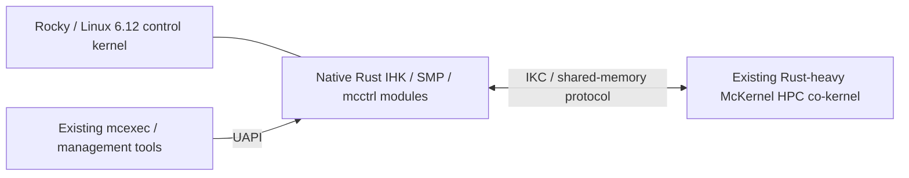

# Existing Rust implementation and native-module reuse plan

Inventory reviewed on 2026-09-06 (America/Los_Angeles), source revision
`24a151fef5b9fcf303fdbb8cf9762340cd4100fd`.

The existing Rust implementation is an input to the native Rocky 10.2 work.
Preserve the working McKernel image and user tools, and assess existing host
Rust bodies before implementing each native-module capability. A native gate
marked TODO means its full acceptance criteria remain unmet; it does not mean
that the repository has no Rust implementation of the associated behavior.

The active goal explicitly requires the final McKernel kernel implementation
to be entirely Rust or assembly. Existing Rust across all source groups must
be preserved and integrated; completing native host connectivity alone is
insufficient. See the [required language acceptance checks](mckernel-rust-assembly-completion.md).

The current [file-level consumer review](rust-consumer-integration.md) separates
active build paths from optional, comparison/test, and pending native sources.
The subsequent [OS resource inventory](rust-consumers-os-resource-20260907.json)
accounts for all 131 current Rust files: 116 unchanged, 13 modified and two
added relative to the immutable baseline, with none removed. All 64 core
crate files and 15 staged native files have matched consumers. The verified
`hash.rs` incremental-build dependency repair remains preserved; complete
native unification is still open. The next steps are recorded in
[the image/boot/application plan](native-image-boot-plan.md).

## Architecture and implementation priority

The next native application boundary is mapped in
[the application service plan](native-application-service-plan.md). It retains
the existing launcher and compatibility helpers while adapting the native OS
file/module lifetime and assigned-topology query path. Actual guest readiness
and sysfs now have separate runtime evidence; application execution remains open.

The user confirmed the intended architecture: Rocky Linux supplies a Linux 6.x
control kernel with Rust support, and the existing Rust-heavy McKernel supplies
the HPC co-kernel. The current native target uses the pinned Rocky-derived
Linux 6.12 kernel with CONFIG_RUST enabled. McKernel keeps its own execution
environment on assigned CPUs and memory; the Linux-side modules manage its
resources, lifecycle, and access to Linux services through UAPI and IKC.



Retain working Rust in place first. For Linux-side integration, use the exact
kernel's existing Rust APIs, then adapt or extract applicable project Rust
bodies, and implement the remaining gaps. Preserve packet formats, syscall
forwarding semantics, and current consumers. Shared logic is useful when both
sides' ownership, locking, and execution contexts permit it; similar names or
packet layouts alone do not make guest code a reusable Linux adapter.

Linux's Rust support is the integration foundation. Its exact available APIs
must still be checked: CONFIG_RUST alone does not provide all the registration,
resource-management, and lifecycle abstractions McKernel needs. Keep new work
focused on those missing boundaries and use the reuse map below to avoid
duplicating existing HPC or host logic.

## Recorded investment

The [source inventory](rust-reuse-baseline-24a151fe.json) records all 129
Git-tracked Rust files in the main repository, their SHA-256 digests, raw line
counts, the build/equivalence inputs, and recursive submodule pins.

| Source group | Files | Raw lines | How the investment is accounted for |
| --- | ---: | ---: | --- |
| `kernel/rust` | 64 | 108,900 | Existing McKernel image implementation; retain and regression-test. |
| `executer/kernel/mcctrl/rust` | 1 | 13,526 | Existing Rust host implementation/helper bodies; first source for native mcctrl adaptation. |
| `executer/user/rust` | 12 | 18,599 | Existing execution and user-tool sources; retain their configured build paths. |
| `tools/crash/rust` | 1 | 1,761 | Existing crash-tool Rust sources; preserve their tool-specific build path. |
| `tools/mcstat/rust` | 3 | 1,356 | Existing monitoring/tool Rust sources; preserve configured targets. |
| `host-kernel/native-rust` | 14 | 10,149 | Existing native module roots, ABI, policy models, and runtime foundations; extend these. |
| `scripts/tests` | 34 | 8,782 | Verification fixtures, including captured upstream Rust; track separately from product implementation. |
| Total | 129 | 163,073 | Source inventory only. |

Outside `scripts/tests`, 95 files contain 154,291 raw lines. Of those, the
81 files outside the new native-module directory contain 144,142 raw lines.
Counts include comments, blank lines, embedded tests, conditional code, and
possible duplication. They do not measure active binary ownership, reusable
lines, remaining effort, or functional completion. QLMPI/UTI and optional tools
must be reported according to their actual build configuration.

The pinned IHK checkout is
`3114d9e7101ad52030eb3effa849a5c108972a1f`; it contains no tracked `.rs` files.
The other recursively pinned submodules also contain no tracked `.rs` files.
Some historical parent-tracker entries describe IHK Rust changes absent from
this pin; [the validation history](../../VALIDATION_PROGRESS.MD) already records
that discrepancy. Do not credit those files as present. Recovery or adaptation
of such work needs a located source revision and a separate compatibility
review; changing the IHK pin is not part of this inventory update.

## Evidence of existing use

- [The McKernel build](../../kernel/CMakeLists.txt) compiles
  `kernel/rust/lib.rs` into `mckernel_rust.o` and makes the image depend on that
  target when Rust is enabled. The crate includes the existing core modules.
- [The compatibility mcctrl build](../../executer/kernel/mcctrl/CMakeLists.txt)
  defaults `ENABLE_RUST_IHK_MODULE_HELPERS` to ON. On x86_64 with Rust available,
  it links `rust/mcctrl_helpers.o`, defines `MCCTRL_RUST_HELPERS`, and removes
  `binfmt_mcexec.c`, `ikc.c`, `mc_plist.c`, `sysfs_files.c`, `arch/x86_64/cpu.c`,
  and `arch/x86_64/archdeps.c` from its C source list. Other C bodies and bridges
  remain in that compatibility build.
- [The recorded artifact evidence](../../rust-source-retirement.txt) attributes
  78.354960% of executable bytes in a specific Rocky 8.10 McKernel image to
  Rust objects at `3a5767b395f932cbe41f717f3c720512009490ff`. That same historical
  checkpoint passed the defined boot/application/shutdown smoke. These are
  existing results, not a fresh build or runtime claim for this inventory.
- [The native staging manifest](../../host-kernel/kbuild/stage-manifest.json)
  selects the new native sources. It does not select the legacy
  `executer/kernel/mcctrl/rust/mcctrl_helpers.rs`. Therefore presence and use in
  the compatibility build do not establish integration into native mcctrl.

## Reuse map for remaining work

Each row identifies inspected source candidates and the remaining boundary.
It is a planning map, not an assertion of complete symbol equivalence or native
runtime correctness. Gate identifiers refer to [final-push.txt](../../final-push.txt).

| Capability / gates | Existing Rust to start from | Disposition and remaining native work |
| --- | --- | --- |
| McKernel execution, memory, scheduling, syscalls; INT-005 through INT-008 | `kernel/rust/lib.rs`, `process_helpers.rs`, `syscall_policy.rs`, `page_alloc.rs`, `x86_memory_helpers.rs`, `sched_helpers.rs`, `futex.rs` | **KEEP ACTIVE.** Preserve the guest implementation and its ABI. Guest-side `send_syscall`, `syscall_generic_forwarding`, and `syscall_offload_wait_reply` already exist; connect native host services to this consumer. |
| Host process creation and syscall completion; MCC-003, MCC-004, MCC-006, MCC-007 | `executer/kernel/mcctrl/rust/mcctrl_helpers.rs`: `mcctrl_control_newprocess_body_result`, `mcctrl_control_start_image_body_result`, `mcctrl_control_ret_syscall_body_result`, `mcctrl_in_kernel_syscall_body_result` | **ADAPT REQUIRED.** Preserve applicable validation and sequencing; replace project C bridge dependencies with reviewed native Linux interfaces and prove registry, wait, cancellation, and lifetime behavior. |
| IKC communication; IHK-008 through IHK-010, SMP-011, MCC-005 | Host `mcctrl_ikc_send_wait_array`, `prepare_ikc_channels`; guest `kernel/rust/ikc_queue.rs`, `ikc_master.rs`, `smp_ikc.rs`, `host_helpers.rs`; native `ikc_queue.rs`, `ikc_master.rs` | **KEEP BOTH ENDPOINTS / EXTEND NATIVE FOUNDATIONS.** Compare packet layouts, ordering, return values, and ownership against existing Rust. Native mappings, interrupt delivery, live connections, and teardown still need integration. Guest code is a peer/reference, not automatically a Linux adapter. |
| Signals and futexes; MCC-008, MCC-009 | Host `mcctrl_control_send_signal_body_result`, `do_futex`, `futex_atomic_cmpxchg_inatomic`, `futex_atomic_op_inuser`; guest syscall/futex Rust | **ADAPT REQUIRED.** Reuse applicable decoding, timeout/error shaping, and sequencing. Review usercopy, atomic access, actual waits/wakes, lifetime, and Linux bridge replacements. |
| procfs and sysfs; MCC-011, MCC-012 | Host `mcctrl_procfs_*_body_result`, `mcctrl_sysfs_*_body_result`, packet handlers, work functions, buffer and tree operations | **ADAPT REQUIRED.** Existing bodies cover substantial behavior. Native file registration, work scheduling, Linux object lifetime, usercopy, and unload-safe callbacks remain separate obligations. |
| Executable registration and ELF handling; MCC-013 | Host `binfmt_mcexec_init`, `binfmt_mcexec_exit`, `load_elf`, `binfmt_is_elf64_exec` | **ADAPT REQUIRED.** Retain useful ELF/interpreter policy. Existing registration calls project C bridges; resolve the native Linux `linux_binfmt` abstraction and in-flight exec lifetime before claiming native registration. |
| Resource assignment, mappings, and image boot; IHK-006, IHK-007, SMP-003 through SMP-012, MCC-015 | Native `smp_resource.rs`, `page_allocator.rs`, `page_owner_registry.rs`, `ihk_mapping.rs`; existing host `reserve_user_space`, `translate_rva_to_rpa`, `mcctrl_remote_page_fault_body_result`; guest `x86_setup.rs`, `x86_memory_helpers.rs` | **EXTEND FOUNDATIONS / ADAPT RELEVANT HOST BODIES.** Distinguish guest address-space algorithms from host CPU hotplug, reservation, mapping, APIC, and boot effects. Inspect existing policies before implementing missing Linux adapters. |
| Device and OS lifecycle, rollback; IHK-003 through IHK-005, SMP-012, MCC-016, MCC-017 | Native `device_registry.rs`, `os_registry.rs`, `os_runtime.rs`, `ihk_ioctl.rs`; existing mcctrl cleanup/control bodies | **EXTEND NATIVE FOUNDATIONS.** Keep the generation/lease/rollback model and unbooted OS adapter; connect booted resource ownership and shutdown. Review existing cleanup sequencing as the behavioral starting point. |
| User execution and monitoring; INT-007 | `executer/user/rust`, `tools/mcstat/rust`, `tools/crash/rust` | **KEEP ACTIVE.** Preserve existing Rust tools and their C ABI consumers. Verify each configured Rust target and its reference fallback when touched. |

In particular, the small `host-kernel/native-rust/mcctrl.rs` is the new native
entry point. It is not the inventory of all Rust mcctrl behavior. Its size must
never be used to describe the entire mcctrl implementation as absent.

## Required reuse record for each implementation change

Before adding or replacing a native capability, record:

1. Existing source paths and symbols, their source revision, and whether they
   are selected in the compatibility build, native build, or only tests.
2. The chosen disposition: retain as a consumer, reuse unchanged, extract a
   shared body, adapt an existing body, or implement a missing body. For new or
   replacement logic, explain why the existing Rust cannot supply it.
3. The remaining Linux API, C bridge, ABI, locking, allocation, and lifetime
   dependencies. Existing project C bridges cannot be carried into the native
   production modules to claim Rust reuse; use kernel Rust APIs or reviewed FFI
   to ordinary Linux exports under the existing native rules.
4. The exact build/equivalence and guest-runtime evidence needed for the changed
   behavior. Reuse the applicable existing fixtures as well as source bodies;
   check their prerequisites against the pinned IHK tree before running them.

Keep original implementations and fallback consumers working while extracting
or adapting shared behavior. Record intentional retirement with a replacement
symbol/build path and equivalence evidence. A copied function with unresolved
bridges is a source candidate, not completed native integration.

## Progress accounting and next deliverables

- **DONE — inventory and build-path review:** existing Rust is explicitly
  recorded, including host mcctrl bodies, fixtures, and absent pinned-IHK work.
- **DONE — initial reuse map:** the major native capabilities now identify
  existing Rust sources and their remaining integration boundaries.
- **PENDING — per-change symbol/dependency closure and adaptation:** the map
  does not claim that existing mcctrl helpers have been wired into native mcctrl.
- **PENDING — native end-to-end acceptance:** reserve resources, boot McKernel,
  execute workloads, shut down, and restore resources through the native modules.

Historical ownership/campaign scores remain historical. The 78.354960% artifact
measurement remains bound to its recorded image. Native production acceptance
remains 350/10,000 evidence points (3.50%); no points are awarded for counting
existing source or writing this plan. Status reports should show the existing
implementation, native integration, and runtime evidence separately.

The staging/link-closure mismatch for `os_runtime.rs` is now repaired locally,
and the original native modules passed the four-CPU unbooted lifecycle run
recorded in [the active work log](native-hpc-worklog.md). Next: finish the
existing resource model's Linux CPU/memory adapter review, then integrate
resource assignment and McKernel boot. The user's active goal authorizes its
isolated guest validation sequence. Source/build checks use the bounded
four-CPU container; experimental modules and kernels execute only in guests.

## Recheck source preservation

The accounting update passed isolated native-container checks with CPU affinity
2-5: `git diff --check`, `python3 -B scripts/final_push_tracker.py --check`, the
preservation recipe below, all 129 file digests and line counts against the
recorded commit, group totals, nine build/equivalence input digests, five
submodule inventories, and the new documentation links. The generated tracker
and every gate/workstream record remained unchanged. No Rust/C implementation,
build input, submodule pin, kernel, or guest runtime was changed by this update.

The JSON inventory is a historical snapshot and must not be silently refreshed
to conceal a removal or rewrite. Run this from the repository root inside the
isolated validation environment. An intentional change needs a reviewed reuse
record and, when useful, a new revision-named snapshot; retain this baseline.

```python
import hashlib
import json
import subprocess
from pathlib import Path

root = Path.cwd()
baseline = json.loads(Path(
    "docs/verification/rust-reuse-baseline-24a151fe.json"
).read_text())
expected = {entry["path"] for entry in baseline["files"]}
tracked = set(subprocess.check_output(
    ["git", "ls-files", "-z"], text=True
).split("\0"))
current = {name for name in tracked if name.endswith(".rs")}
if current != expected:
    raise SystemExit("Rust file set changed; review additions/removals")
for entry in baseline["files"] + baseline["build_and_equivalence_inputs"]:
    path = root / entry["path"]
    if not path.is_file() or hashlib.sha256(path.read_bytes()).hexdigest() != entry["sha256"]:
        raise SystemExit("Review changed or missing source/build input: " + entry["path"])
for entry in baseline["submodules"]:
    actual = subprocess.check_output(
        ["git", "-C", entry["path"], "rev-parse", "HEAD"], text=True
    ).strip()
    if actual != entry["commit"]:
        raise SystemExit("Review changed submodule pin: " + entry["path"])
print("Existing Rust sources, build/equivalence inputs, and submodule checkouts preserved")
```
